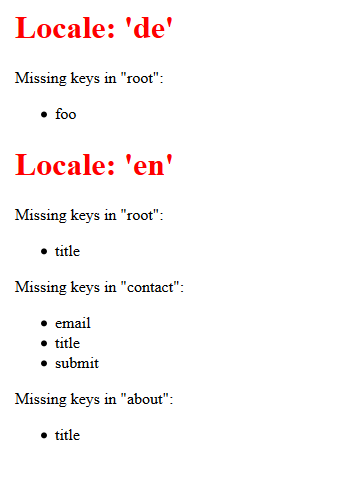

# inidiff
This project was a quick-and-dirty experiment to simplify the comparison of two or more [INI files](http://en.wikipedia.org/wiki/INI_file) on a section and key basis.

I created this project because localization for a project I worked on was based on INI files. This tool helped me to ensure that all senteces were translated.


Here is an example result:


License: MIT

## Usage

If you want to use it, modify the `locale_dir` on top of the `ini_diff.php` file or put your ini files in the examples folder.

The easiest way is to serve the app it via the PHP built in webserver (XAMPP etc works fine as well...)

```bash
php -S localhost:8000
```

## Disclaimer
**Dont use this in production! The code quality is very low!**